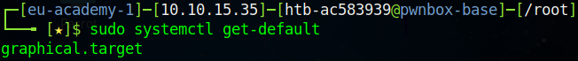

# Masking

Services have two levels of "off", we know this from previous commands we have reviews: `systemctl start` and `systemctl enable`. With `systemctl start` we start the service immediately. We can also, as implied, stop the service. This is the first level of "off" for a service.

The second level of "off" we have seen is that of the `systemctl enable` command. Again, implicitly, we can also disable a service. These commands do not take effect immediately, instead they control whether the service will be started (or not) on the next boot.

The third level of "off" differs from the others and is used far less commonly. `Masking` is the third level, but before we can understand `masking` we need to understand why it exists. `Systemd` is more powerful than the legacy init startup system. In the old init system services start and stop in the order determined by their file names. These files are usually links placed in a directory, named after the runlevel in which they should operate. It is important to understand that init scripts are actually `imperative` shell scripts executed by an interpreter. This means they contain commands the system runs to manage the service. However, `systemd` unit files are `declarative` statements of intent, as such, they give hints to `systemd` to manage the services, however, `systemd` takes care of the execution.

As such, unit files are typically shorter than the init scripts they replace. This is because they don't have to worry about implementation of the service, but only it's intent. Runlevels are a definition of a system state where certain processes and services should run, there are a specific set of runlevels defined.

 

Runlevels

| Runlevel | Definition |
| --- | --- |
| 0 | halt |
| 1 | single-user |
| 2 | multi-user |
| 3 | multi-user with networking |
| 4 | undefined (user defined) |
| 5 | multi0user with display manager (graphical login) |
| 6 | reboot |

 

In systemd there is no concept of runlevels as in the legacy init scripts. These are instead replaced by a concept called `targets`. In systemd there can be an unlimited set of `targets`, each `target` is represented by a unit file with a `.target` suffix. `Targets` can and do depend on one another, only once a system has reached `multi-user.target` does it start the services specified in `graphical.target`, which corresponds to the same Runlevel stages as in the legacy init. There are also implicit dependencies on `basic.target` whcih, as the name suggests, established basic system services and functions. Some of these happen throguh their own target dependencies such as `network.target`.

Unlike this legacy init, `systemd` is far more powerful. `Systemd` can tell when a system rungs, and also what it's dependencies are between other units. This means `systemd` can tell when one unit must be started prior to another for it to run successfully. `Systemd` is smart, and will use this information to start a required service, even if it is disabled, in order to satisfy dependencies.

`Systemd` uses several locations to store unit information:

- /etc/systemd/system
- /run/systemd/system
- /usr/lib/systemd/system

The unit files on a system determine how systemd will start and run. Each corresponds to a single activity or component — or unit in systemd terms. Each unit file is a simple text file describing a unit, what it does, what needs to run before or afterward, and other details. Units stored in the earlier directories override the later ones, this is a useful scheme, as it allows the user to make changes in the /etc directory, where configuration is expected, as such, users should avoid making changes in /usr.

`Systemd` can also run in a user context, managing resources per user in addition to system-side. Unit files for user units are similarly stored in `/etc/systemd/user`, `/run/systemd/user`, and `/usr/lib/systemd/user`.

`Systemd` understands numerous types of units, the two most common being; `service` and `target` units, we can filter these providing the `--type` option to `systemctl`:

<pre>
<code>
    systemctl list-unit-files --type service
</code>
</pre>

`services` are units which describe a process `systemd` can start and monitor. `Service` units are the most common units we use daily, an example is the `sshd` daemon. If we take a look at the `sshd` unit file we see the following definition:

<pre>
<code>
[Unit]
Description=OpenSSH server daemon
Documentation=man:sshd(8) man:sshd_config(5)
After=network.target sshd-keygen.service
Wants=sshd-keygen.service

[Service]
EnvironmentFile=/etc/sysconfig/sshd
ExecStart=/usr/sbin/sshd -D $OPTIONS
ExecReload=/bin/kill -HUP $MAINPID
KillMode=process
Restart=on-failure
RestartSec=42s

[Install]
WantedBy=multi-user.target
</code>
</pre>

`Targets` instead are used to link and group other units together to describe the desired system state. We can look at the `multi-user.target` as an example:

<pre>
<code>
[Unit]
Description=Multi-User System
Documentation=man:systemd.special(7)
Requires=basic.target
Conflicts=rescue.service rescue.target
After=basic.target rescue.service rescue.target
AllowIsolate=yes
</code>
</pre>

This target unit file contains no command to execute. Rather, it functions purely as a means of connecting other units, this is common amongst most targets.

Now we have a basic overview of `units` and where they fit into our system we can understand the third level of "off" `Masking`. To record unit masking, `systemd` uses the local system configuration files located in `/etc/systemd`. When masking `systemd` writes a link file pointing to `/dev/null`, this is known as the `nothing` file in UNIX and Linux.

If we mask the ntp service:

A symlink is created within `/dev/null`. This is equivalent of running the `ln -s` command, writing the output to the `/dev/null` path. This is what it means for a service to be `masked`, this will show when we check the `status` command on a masked service, this will show the service as `masked`.  If you boot the system with a unit masked, it will not run even if the service is required to satisfy dependencies. You should ensure you know what you are doing before masking units.there is the potential to prevent a system booting normally if an essential service is masked (e.g. `system.slice`).

If we try to start a masked service, we get an error describing exactly why we cannot start the service. If we want to start this service, we have to `unmask` the service first.

If we try to enable a service, the same rules apply. This can be useful if we need to "sleep" a service to prevent it interfering with other services, for instance,
if we are performing some setup, using `firewall` services, installations, etc... we sometimes have to mask and unmask services to prevent them interfering whilst we perform our tasks.

`Targets`, as we have previously covered, are a specific daemon type that describe the `state` that we want our system to be in. We can thing of `target` as being the state which we want our system to reach. In this system we interact mostly with `multi-user.target` which contains a list of steps needed to undergo to attain the target state. We can check these dependencies via the command: `sudo systemctl list-dependencies multi-user.target`, this will work for any `service` but for `targets` is particularly useful as we can see which services will be started in order to achieve the target state.

There are many services listed, far too many to display here. You will notice this is in a tree format, these are all the services which must be started to reach the target state. `Targets` can also be nested within the `target` itself. For instance, `systemd` itself has a default target that it uses when it boots the system, this is the system state we want to have, known as the overall system state.

We can see this `systemd` default target with a single command: `sudo systemctl get-default`, as you can see below, the default is `graphical.target`, our graphical login service, we can take a deeper look at this by listing the dependencies of `graphical.target`.

In listing the dependencies of `graphical.target` we can see this contains the dependency `multi-user.target` meaning that this target will start up on boot in order to reach the target state declaration set out by `graphical.target`. The system will be ready to go when the specification of `graphical.target` has been met. We can log out another target and inspect some of the contents of it's declarations.

<pre>
<code>
#  SPDX-License-Identifier: LGPL-2.1-or-later
#
#  This file is part of systemd.
#
#  systemd is free software; you can redistribute it and/or modify it
#  under the terms of the GNU Lesser General Public License as published by
#  the Free Software Foundation; either version 2.1 of the License, or
#  (at your option) any later version.

[Unit]
Description=Multi-User System
Documentation=man:systemd.special(7)
Requires=basic.target
Conflicts=rescue.service rescue.target
After=basic.target rescue.service rescue.target
AllowIsolate=yes
</code>
</pre>

We see that we have a description, some documentation, we can see that this unit requires `basic.target`, we have two conflicts, `rescue.service` and `rescue.target`. This is actually a full mode of itself, it is similar to safe mode on Windows, called isolation. We can run isolation via the command: `sudo systemctl isolate rescue.target`, this runs only the services required to reach the `target` in isolation, everything else will be disabled. 

___

[<< prev](./12_daemons.md) | [next >>]()

