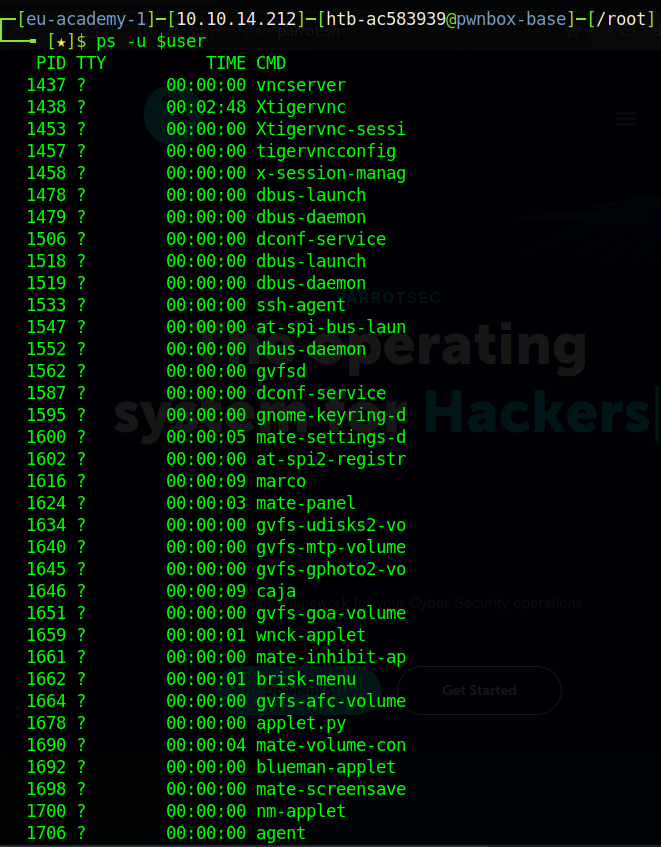

# Processes

Processes are a fundamental part of Linux, as we covered previously we have different types of processes. What we have yet to visit is the states which these processes can be in. We alluded to this previously when we started, stopped, enabled, and disabled `daemons`, which as we know are a type of service themselves.

Any given service can be in a number of states:

- Running - The service is running normally
- Waiting - The service is waiting for an event or system resource
- Stopped - The service is stopped
- Zombie - The service stopped but still has an entry in the process table

Processes can be controlled with various commands we have covered, some aditional commands which can be useful are listed below.

Commands

| Command | Description |
| --- | --- |
| kill | Send a signal to a process  |
| pgrep, pkill, pidwait | look up, signal, or wait for processes based on name and other attributes |
| killall | kill processes by name |
| ps | report a snapshot of current processes |
| top | display linux processes |
| htop | interactive processes viewer |

We can view all the available signals via `kill -l`. Many of these wont make much sense right away, but here are some common signals:

Signals

| Signal | Description |
| --- | --- |
| 1 | **SIGHUP** - This is sent to a process when the terminal that controls it is closed. |
| 2 | **SIGINT** - Sent when a user presses **[Ctrl] + C** in the controlling terminal to interrupt a process. |
| 3 | **SIGQUIT** - Sent when a user presses **[Ctrl] + D** to quit. |
| 9 | **SIGKILL** - Immediately kill a process with no clean-up operations. |
| 15 | **SIGTERM** - Program termination. |
| 19 | **SIGSTOP** - Stop the program. It cannot be handled anymore. |
| 20 | **SIGTSTP** - Sent when a user presses **[Ctrl] + Z** to request for a service to suspend. The user can handle it afterward. |

We often use these signals when we run process commands, for instance, if I want to force `kill` a process (which you have likely already done before) I would use `SIGNAL` 9, for example: `kill 9 <PID>`.

## Background Processes

Other than killing processes there may be other ways we need to manipulate them. Sometimes it is necessary to put the scan or process we have just started into the background, doing so allows us to free up the terminal session to interact with the system or to start other processes. As we have already seen we can do this with the shortcut **[Ctrl + Z]**, this sends the **SIGTSTP** signal to the `kernel` which suspends the process.

 

 

In the above example we start two services, first of all we begin a ping with a count of 10, we interrupt this with a signal to suspend the service via **SIGTSTP**. We then start another service in the same session opening up `vim` to view the contents of `tmpfile`. Since we have suspended these two processes we free up our terminal, but how can we view the services? they haven't stopped running, yet we can no longer see them. This is where the `jobs` command comes in. This command lists all of our active `jobs` (processes) in the session. We can use `bg` to put the process in the background. Another options is to set the process with an ampersand (`&`) at the end of the command, in this case we will see the results when the process finishes.

## Foreground a Process

Using the jobs command we can list all background processes. Backgrounded processes do not require much interaction, and we can use the same shell session without waiting until the process finishes first. Once the scan or processes finishes, we are notified by the terminal. If we wish to pull the background process into the foreground so that we may interacti with it again we can use the forground command `fg`.

 

# Executing Multiple Commands

There are three possibilities to run several commands, one after the other, there are separated by:

- Semicolon (`;`)
- Double `ampersand` characters (`&&`)
- Pipes (`|`)

The difference between them lies in how the precious process is treated. Treatment depends on whether the previous process exited successfully or with errors. For instance, the semicolon (`;`) is a command separator and executes the commands by ignoring the previous commands results and errors:

We can execute the same command and replace the second echo with an `ls` command to show what will happen if there is an error, the commands succeeding the command which errored will execute regardless.

However, this looks very different if we use the double `ampersand` characters to run the commands one after the other. If there is an error in one of the commands, the succeeding commands will no longer be executed and the whole process will abruptly halt.

Pipes (`|`) depend not only on the correct and error free operation of the previous processes, but also on the previous processes results. We often think of pipes as the logical `OR` and `ampersands` as the logical `AND` operators.

## Process Management

So, how do we view processes? we have seen a way to view `jobs`, process which have essentially been `paused`, `suspended`, `put on hold`, but what about te other processes? for this we can use the `ps` command. Running `ps` without any arguments will show only the processes running within our session. We can provide flags and options to the `ps` command to get more output, including listing all of our processes, or specific processes. If we `suspend` a process it will be displayed in `ps`, if we are still in the same `session` we can even list it without passing additional arguments:

This is also true if we `background` the process. We can find all of our processes for a particular user by passing the `-u` flag, we can also pipe our output to grep to search for a particular process, in this case `firefox`. Note that in this example we have previously set our username to a variable to make it easier to use, this is possible via `user=$(whoami)`.

We can find all of our processes for a particular user using `ps -u <USER>`, it is often easier to grep the specific process we are looking for however, as the output can often be large.

Here we can see all of our PIDs, but the command itself is rather long. In Linux there are many ways to achieve the same goal, however, we can find a shorter method with one of the commands we have already listed previously: `pgrep`. The `pgrep` command is a command which combines the functionality of both `ps` and `grep` (general regular expression print). If we run this command passing a process name as an argument we receive the `PID` for that process, in our case `pgrep firefox` returns `7855`, we can use this to find an unruly process `PID` to suspend or even kill that process.

A common pattern you will see is the command `ps -aux`. If we take a look at the help page for `ps -aux` (simple format) we can see what each flag will do for us:

We can see that `-a` gives us all with a `tty` which includes other users (all users), `-x` gives us the processes without controlling `ttys` (all the processes, not executed by this terminal session) and `-u` the user that the process belongs to.

We can use the `top` command to list all of our processes, ordered by `cpu` usage. We also have a prettier version of this in the form of `htop`.

 

___

[<< prev](./13_masking.md.md) | [next >>](../chapters/15_webservices.md)

