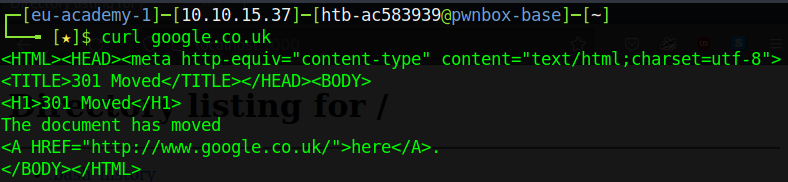
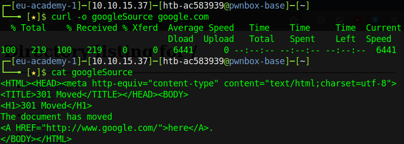
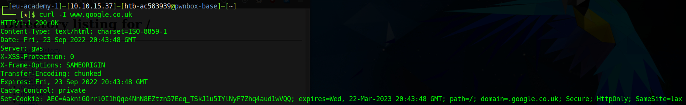
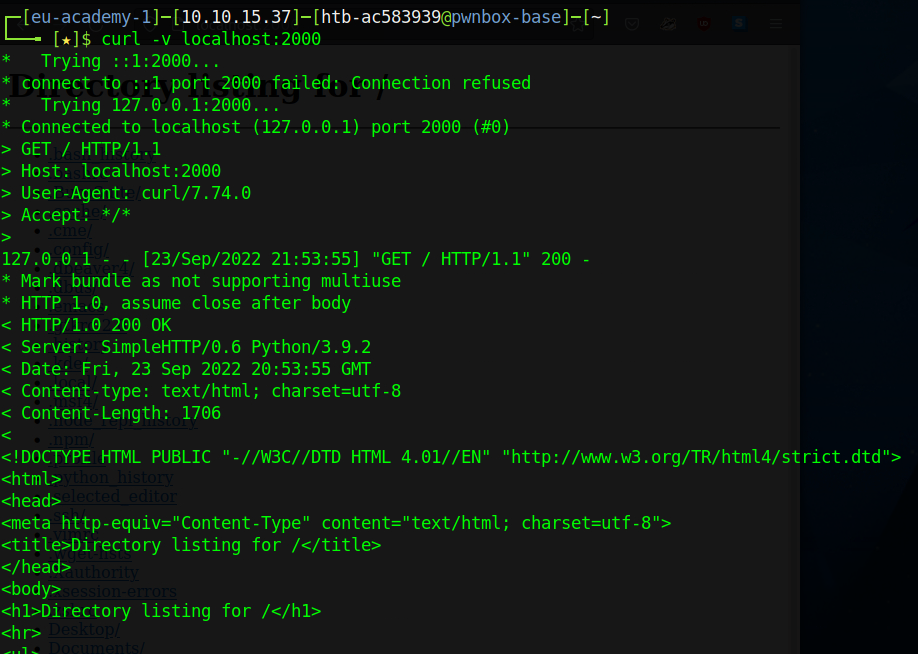

# Web Services

An essential component to all services is the ability to communicate at a distance. This is the entire principle of networking and the internet, to be able to send messages at a distance of various lengths, and receive them on another machine connected on the same network through a system of cables, and wifi, light, or infrared signals. Communicating between systems requires sockets, and servers. A typical communication of this sort is the communication we use in development often. We spin up servers on our local machines using a loopback address to view our content as we develop on our local system. Two of the most common web servers we see today are Apache and Nginx, if you work in development it is very likely you will be using either one, or sometimes both, of these web servers, though there are also many others out there.

We can encrypt the communication between browser and the web server (`mod_ssl`), use as a proxy server (`mod_proxy`), or perform complex manipulations of `HTTP` header data (`mod_headers`) and `URLs` (`mod_rewrite`).

We can spin up a web server with `apache2`, `nginx`, or a variety of other means. A very quick way for instance may be using `node` if it is installed on your system, however, this may not be installed on all systems, and still requires some scripting and configuration. If we want to fire up a web server incredibly quickly, a quick means of doing so is to launch a `http` server using `python`. We can do this using the command `python -m http.server` assuming `python` is already installed as it is on multiple `Linux` distros, if not we would of course need to install `python` first.

 

 

Notice that the web server launches on a non-standard `port`. Most web servers we expect to start on `port` `80` by default, or `443` which is becoming increasingly common with `SSL`. We can choose a custom `port` to run our web server on by specifying a number for it at the end of the command: `python -m http.server 2000`.

We access this web server via `localhost:<PORT>`, you will notice that a `Directory` page is shared, this is because we don't have an `index` for the web server to serve, we are also not restricting our web server to serve only the `index` and therefore anyone accessing the web server has access to our directory, don't worry this is currently only a local loopback address. Some other options we can use are `php` to spin up a web server, which we can do via: `php -S 127.0.0.1:<PORT>`. As we previously alluded to we can also use `npm` to spin up a `node` server: `npx http-server -p 2002`. Alternatively, we could install the `http-server` package available in `npm`, this would then enable use to use `http-server -p port` to fire up a server.

 We can also fire up an `apache` service, this becomes a bit more involved, first we must start the service: `systemctl start apache2.service` we then need to edit our default port inside the file `/etc/apache2/ports.conf`, this is our server configuration file, we want to change the port to a free port on the `listen` line.

 

 

We can "talk" to our servers, and any external servers, using the `curl` command (client URL). `Curl` runs almost anywhere, and is preinstalled on most systems, making it an incredibly useful tool. We can use it to download files, and even using multiple protocols. If we want to "view" the content of our `server` in the terminal we can simply use `curl localhost:<PORT>`, if we want to view an external source we can specify the address of that source too.

 

 

We can also use `curl` to save the content we view to files using the `-o` flag.

 

 

We can even use `curl` to analyse how a client talks to the `server` and vice versa using the `-I` flag.

 

 

This is a response header from the server. It shows us the type of content being received, the date it was received, the protocol used, the status of the message, the encoding, the cookie being saved, the server, and more. This is only one side of the conversation however, any devs will know that in order to get a `response` from the `server` a `request` must first be made, and we can also take a look at the `request` headers being sent. We can do this using the `-v` flag (or switch): `curl -v localhost:<PORT>`the encoding, the cookie being saved, and more.

 

 

We can see which is the `response` header and which is the `request` header by the direction the parentheses are pointing: `>` = request, `<` = response.
We may also use a tool similar to `curl` called `wget`, using `wget` we can download a target page.

 

 

___

 

**\*** Please note that everything detailed here   can easily be found by inspecting the `man` pages.

 

When in doubt, ask the `man`!

 

___

[<< prev](./13_masking.md.md) | [next >>](../chapters/16_navigation.md)

