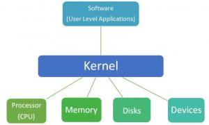
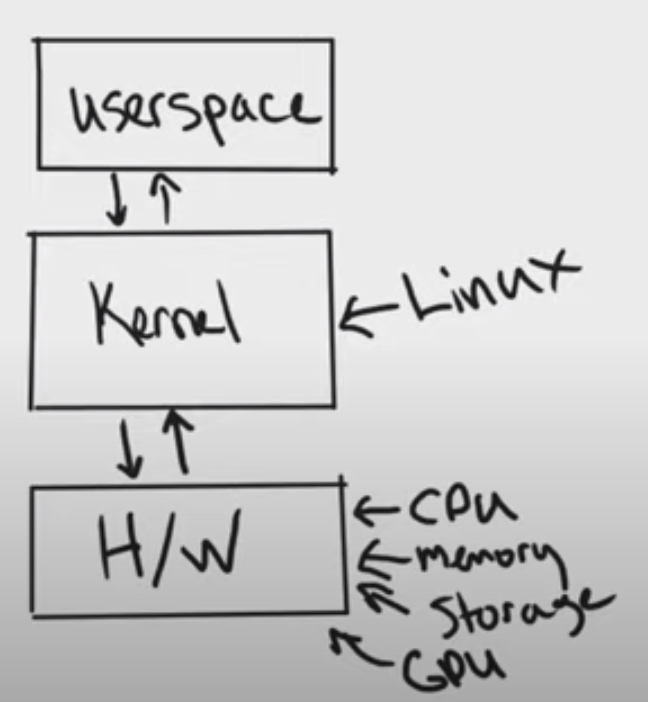

# Kernel

The Kernel is a program at the core of every Operating System (OS), having full control over the systems performance. In Linux, its source is the `/boot` directory. Kernels differ depending on the OS we are using, or even dependent on what Kernel we ourselves install. There are hundreds of distributions of Linux, as one of the most popular OS Linux has been re-packaged in many different forms, Linux is based on the UNIX OS, however, there are far closer OS to this original Unix; For instance, Mac OSX Leopard is built upon code and certified under the single unix specification, this is the collective name of a family of standards for computer OS which qualify under the name "Unix". Most Linux distros are also available as open-source, whilst Unix applications are generally paid-for. You can delve into the differences at the OS level more [here](https://techcrunch.com/2008/03/24/arent-unix-and-linux-the-same-thing-yes-and-no/?guccounter=1&guce_referrer=aHR0cHM6Ly9zZWFyY2guYnJhdmUuY29tLw&guce_referrer_sig=AQAAAB6KeeztfoiCZVSp2VxL_0WwD1YDcQXM7iuuWxKPnRs_O5kHcLCBwcYUWTHi8lmaw-SGywPaUOLeWyjMXAj6rTHqFSTGr98hcmvBDVnSkht3p3HJXf05RdWJD99h3gEChxDl9fnm9nrHa0M-OInyMB23-1N2lzS9v64FoEst4OoR) in this chapter we are going to focus more on the communication between the Kernel, OS, and Hardware.

 

 

In simplistic terms a Kernel is a bridge of communication between the user applications and underlying hardware. There are different types of kernels dependent on the use case; Monolithic, Micro, Hybrid, Nano, Exo. Each type of Kernel has its own advantages and disadvantages. No matter which Kernel is in use it performs the same operations, however, the speed and location may vary:

 

Kernel Types

Monolithic Kernels

The OS is divided into user space and Kernel space. Kernel space is dedicated to only Kernel specific tasks. Monolithic kernels are the types of kernels which enable both of these spaces to have a shared location in memory. The advantages of this is that tasks and processes performed in the shared location execute much faster as the transfer space isn't required. Scheduling tasks and file management are conducted only by system calls. This does however negatively impact the size of the Kernel, which also inflates the OS meaning we require more storage space for the Kernel and OS. UNIX itself is an example of one of these kernels.

 

Micro Kernels

In micro kernels the User and Kernel possess different space in the memory address. As they share space the OS can be much smaller, communication is conducted via message parsing which is slower and reduces the size of execution, in this Kernel new services are easily added.

 

Hybrid Kernels

A Hybrid is a combination of both the Monolithic and the Micro architecture. As such, it acquires attributes of both. This means a Hybrid Kernel has no only the speed of the monolithic Kernel, but also the modularity of the micro Kernel, however, it does have some different parts running in differing locations in memory; some will run in the user space, some in the Kernel space. Examples of this are the Windows NT and CE kernels.

 

Nano & Exo Kernels

A nano Kernel is simply and even smaller Kernel than the Micro Kernel. This is a bit more extreme, as are Exo kernels, which facilitate application-specific customisation, as resource protection is placed at a different space in memory from management.

 

Now that we have the types of Kernel out of the way, it is important to understand that an OS cannot function without a Kernel. The Kernel handles all the necessary operations such as handling the peripherals, I/O operations, selecting the most suitable processes to be executed next in the stack, or any processes which should be temporarily blocked.

Meanwhile, the OS tracks the system performance and memory load. Tasks such as memory, task, process, and disk management, ensuring that proper communication between the hardware and software can be instantiated.

The kernel continues to run in the background memory until the computer is shut down, it takes care of various operations. Certain processes need to communicate with the OS, in order to do so they must first send the request to some intermediary between them. This intermediary is the kernel. This is what we refer to as "system alls", these invoke the kernel so that the users requested operations are performed.

It is important to note that not all users can access the kernel data as it is loaded into the protected memory of the OS, reserved for only the specified purpose, this is known as the "kernel space". Adversely, any application, other than the kernel, runs in what is known as "user space". Users usually deal witht he lowest level of the kernel, where the kernel communicates directly with the OS. hardware and software communication is not possible directly, due to the fact that the OS only understands binary or "Machine code", natural language must first be converted and interpreted by a system. In this manner, the kernel is a direct link between the hardware and software layer:

 

Core Functions

Process Management

Processes are the things currently running on the OS. As each process requests access to some hardware, disk, memory, etc... the kernel is the thing which controls which processes are to be distributed to which process, and when. The information between these processes is shared in order to allow proper synchronisation.

 

Device Management

One of the most core functions of the OS is to manage all devices associated with the OS. The OS manages all the hardware, software, storage, I/O devices. OS Kernels ensure that the status is shared and tracked via device drivers and controllers which are composed into three types of registers; commands, status, and data.

 

Memory Management

Initially all the processes are saved on the disk. Here, they have space allotted, this acts as a kind of "pool" of processes. The process of transferring these from the disk space to the main space in which they run on the foreground is what we mean when we say "memory management". The kernel moves the processes back and forth in the same way, keeping track of all allocated space. The decision of freeing up or assigning memory to any given process is performed in memory management, with three types of addressing; symbolic, relative, physical.

 

Interrupt Handling

There is a specific section of the kernel which conducts interrupt handling. When a system call is made, a signal is sent to the kernel requesting resources, the kernels interrupt handler is responsible for "handling" this signal. A process may continue to work until it is interrupted by another process. Once this alternative processes interrupt signal is sent, and requested to be brought to main memory, the task allocation itself is conducted by the Kernel, which reviews the most suitable interrupts.

 

I/O Communication

The communication of hardware devices, specifically input and output devices, require the kernel to act as an intermediary between the hardware and software layers. These devices send requests to the Kernel, which then returns interrupt and schedules them for execution.

 

As you have likely gathered, much of what we need from our system is handled by the Kernel. Whether we are setting up networking, requesting, or allocating resources, communicating with hardware, or performing any other kind of input/output operation, we are interacting with the OS via the kernel. We can find our kernel file on other systems using the `uname` command, by finding our Linux Kernel version, we can then learn where the kernel file lives in our specific system. We can even replace our kernel if we so wish, this is commonplace in `Arch` as we want to use a long term support kernel (lts).

This can be a lot of information, and can be difficult to understand, and even to explain. however, we can think of the Kernel as simply another program on our computer which handles communication with our OS and hardware. It is a layer in our system, it is used by the OS to access the interact with resources (e.g. hardware), we can picture this as another layer in our system. Communicating with the layer is as highly complex task, this is why we have a program (the kernel) dedicated to it. There is also a third layer which we previously mentioned, the user space. The user space is the part of the system the user sees and interacts with (the part YOU are using right now). As such, we can think of the kernel as a translation layer between the user space and the hardware levels.

 

It is important to differentiate between the Kernel and OS as the tight link between them can be confusing, remember, the kernel is NOT the OS. It is a program layer between the user space and hardware. When we talk about Linux we are often talking about the kernel, when we talk about distros we are talking about an installation of packages which have been put together usually encapsulating applications, a desktop environment, a kernel, init systems, and more. Please note that we have only touched on the basics of the kernel here, the kernel is incredibly complex and does many more things on top of these.

___

[<< prev](./17_editingfiles.md) | [next >>]()

