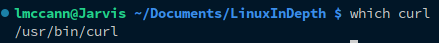
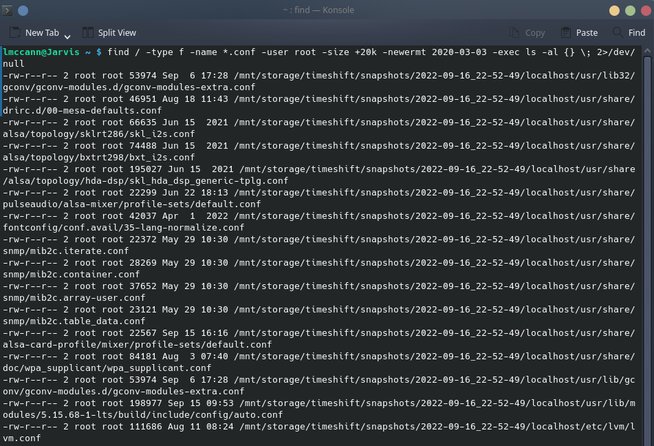
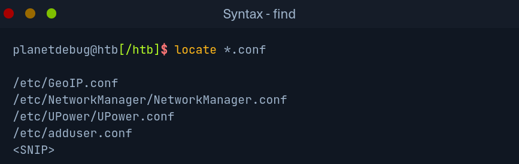

# Searching

One of the most important things in any filesystem is the ability to find the files, folders, and programs, we need. Once we have gained access to a Linux based system it is essential we are able to quickly access configurations files, find useful scripts, potentially those written by administrators, and other useful files and folders. Considering how large a system may be, we do not want to have to manually search through the filesystem for useful information. To help with this, we have various tools at our disposal.

 

Which

One of the most common tools, which usually comes installed preinstalled on our system, is `which`. This returns the path of the file or link that should be executed, it allows us to determine if specific programs are available on the OS, not only this, but if there are multiple versions in multiple places, it allows us to check which version is actually being used in a given location.

 

Find

Another useful tool is find. Besides merely being used to find files and folders ths tool may also filter results. We can use filter parameters such as the size of the file, or the date, we can also specify if we only search for specifically files or folders.

options

| Option | Description |
| --- | --- |
| `-type f` | The type of the searched object (in this case `file` |
| `-name *.conf` | Indicate the name of the file we are looking for `*` wildcard with `.conf` extension |
| `-user root` | Filter all files whose owner is the `root` user |
| `-size +20k` | Only files larger than `20KB` |
| `-newermt 2020-03-03` | Only files newer than the specified `date` |
| `-exec ls -al {} \`| Executes the specified command, curly braces as placeholders for each result, backslash escapes the next character, and semicolon to terminate |
| `2>/dev/null` | `STDERR` redirection to the `null device` this redirection ensures no errors are displayed in the terminal |

 

Locate

It takes time to search through the whole system for files and directories. It also takes time to perform many successive searches. The command `locate` offers us a quicker way to search through the system, in contrast to the `find` command `locate` works with a local `database` which contains all information about existing files and folders. We can update the database using `updatedb`. Once we have updated our database definitions we can now use `locate`. Note that this command may not be available on all systems, but it has the advantage of producing results much faster than `find`.

The disadvantage here is the lack of filter options, and as mentioned prior, the fact it is not always available on systems such as `Arch`.

 

