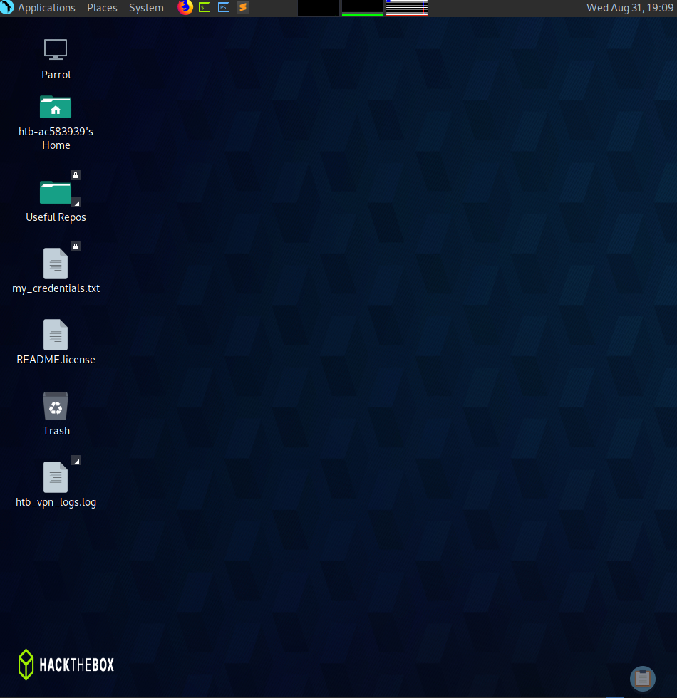

# Parrot OS

Parrot OS is a Linux distribution. As per the previous chapters, all this means is that it is an OS built upon the Linux Kernel. This means that whenever we engage with the OS, the OS sends a request to the Kernel which checks if we can attain the required hardware resources.

Parrot is a distribution based around development and security. It is similar to Kali but far more lightweight, whilst Kali Linux requires a minimum of 20GB of harddrive space, Parrot can get by with 15GB. Parrot also requires less RAM (around 300MB) in comparison to Kali which requires hardware acceleration requiring at least 1GB, both are debian based distros.

When booting into Parrot OS you are greeted with a desktop as such:

We will not be using the GUI very much, the true power of Linux systems lies within the terminal (CLI).

___

[<< prev](./3_fileSystemHeirarchy.md) | [next >>](./5_commands.md)

