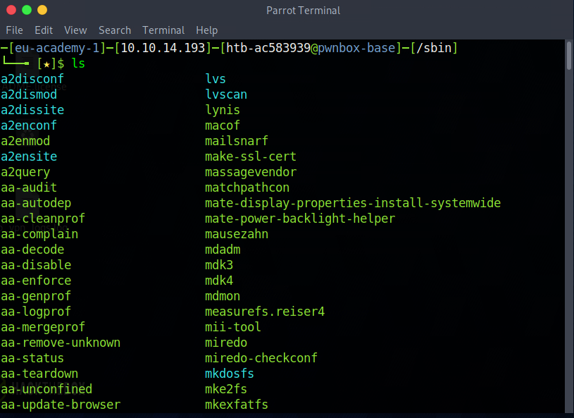
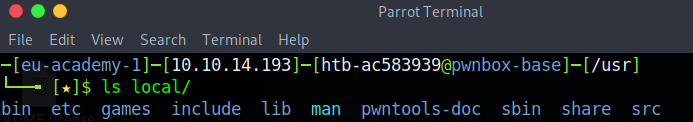

# FileSystem Root

The first thing we will discuss when talking about Linux is the Root of the filesystem.
If we list the directories at the Root location of Parrot we see a large list of directories and files of varying names which can appear a little intimidating at first (though we have actually covered these locations in previous chapters already). This is the idea we were talking about in the Philosophy section, in Linux systems, everything (literally) is a file; configuration, network settings, IP, profiles, devices, are all represented as files in Linux, even the commands we use are represented by files.


If we enter our bin (binaries) directory we can quickly see that our commands are listed within the directory (note that in the example I have filtered to a specific command, this is because there are so many it is difficult to display, just take a look yourself!). The bin folder contains our essential command binaries. If we ```cat```, standing for concatenate, one of these files we can view the content of these commands. You will see the command binary printed on the screen, this is not human-readable, instead it is a binary string of which the layout is specified by formatString.


So, we now understand where our command binaries are stored in Linux, however, heading back to our root directory you may notice another directory named ```sbin```. Much like the ```bin``` folder this directory contains commands, however, these are commands that are required to boot the system which are not executed by normal users. In this sense, it can be useful to think of this as the ```super bin```. Lets enter the ```sbin``` directory to demonstrate what is meant by this.



Looking down here you should see a list of commands, note again that they are files following our Linux philosophy. These commands are special, in the sense that they are only usable by administrators.

If you want a hands on example of the types of commands, try running ```sudo adduser``` and create a new user for yourself. If you cannot see this command in the directory as it is you can always pipe the ```grep``` command to search for a specific string on your ```ls```. Once you have created a user cd back to our root directory, take note of the ```usr``` directory within root.

If you list the contents of the usr directory you may find a bit of a shock. If you have never accessed this directory before it can be somewhat confusing, notice how there is yet another ```bin``` and ```sbin``` directory within our ```usr```, see if you can work out what this directory is for before continuing reading. If you list the contents of these directories you will see much the same that we saw in the previous two directories we examined. If you are interested in knowing about the history of this there is an interesting rationale as posted by a user on the [askUbuntu forums](https://askubuntu.com/questions/130186/what-is-the-rationale-for-the-usr-directory).


Moving on, the usr/bin and usr/sbin directories are essentially the same as the bin and sbin directories, however, the usr/bin and usr/sbin will typically house more commands. Now you may be wondering: "if these commands are in multiple locations, how do we know which one we are using? am I running the usr/bin/ls or the bin/ls?" we can check the path of the command using ```which```.


Notice that in either location we use the same ```ls``` command from the ```usr/bin``` directory. This is because we are now a user, therefore we execute the commands from this location, during boot, essential binaries would instead be run from the previous ```bin``` location.

If we head back to root, our next directory of interest is our ```local``` directory. If we list our files here, we once again find a familiar structure:



This is a location where you can create your own commands, install your own software, outside of what is provided by the distro itself, without worry of overwriting distribution files.
We then also have the /usr/lib directory, this contains libraries shared between the command binaries.

Heading back into our root folder, we see a ```boot``` directory, you have probably already worked out, this contains boot files. We also have ```var```, if you have ever done any development on a Linux system, whether that be a server, docker container, vagrant, or even using htdoc directly on a server installed on your local machine, you will likely have seen this folder. This is the folder where your log files will live.  We then have ```tmp``` which, as you probably guessed, houses temporary files, only save things here that you don't mind losing after reboot.

We should next inspect the ```home``` directory. Here you will see listed all of the users available on the system, you can even enter the user directory, list the directories owned by the user and you will find each of these users "homes" live within this ```home``` directory under their corresponding users directory. You may have noticed one user who doesn't have a home, the ```root``` user, this user has no home within the directory we just viewed, so where does he live?

If we cd back into our root directory, you can find the root user in the ```root``` folder. The root user is special, to access root you need sudo access.


Notice that this directory is identical to any other ```home``` directory, this is because ```root``` is a user like any other, but with additional privileges. You should only use ```root``` when necessary and never give root access to a program or person you don't trust.

Earlier we mentioned even devices in our system are files. We can view these in our root/dev folder, where ```dev``` stands for devices.


You will notice a lot going on in this folder, we have ```stdin``` (standard input), ```stdout``` (standard output), among other things. The thing we are going to look at right now is ```vda``` and ```vda1```, these are our "hard disks", where vd stands for virtual disk. On other systems you may see them listed instead as ```sda``` instead. Since this is also a file, we can actually output the contents of our disks to the console, however, this will lock the console due to continuous output, so we will have to ctrl + c to exit.

Now, we know that everything in Linux is a file, earlier we mentioned settings and configurations were also files, if we wanted to access our network settings, where would we find this? the answer is in the ```etc``` directory, another name you may be familiar with as a dev, especially if you have ever had to search for apache2 or config files.

We have many config files in here, but we will focus on the ```network``` config for now. Enter the ```network``` directory and we can list our files. If we cat the interfaces file we should see the configuration for our network interfaces, if we ever wanted to change the network settings we would enter this file to change the contents.


Lets get back to ```root```. Take note of two other directories here, the ```mnt``` and the ```media``` directories. These two directories share a common function, they both mount drives. When you plug in a USB flash drive for instance, it will automagically be added to the media directory as a file. The difference here is that the ```media``` directory mounts drives automagically, like our example of mounting a flash drive, however, the ```mnt``` directory is for drives that we might mount, these don't occur automagically and instead are mounted manually.

<br />

___

If you would like to review any of these, please see the quick reference in [Chapter 3](./3_fileSystemHeirarchy.md).

___

<div align="right">

[<< prev](./5_commands.md) | [next >>]()
</div>