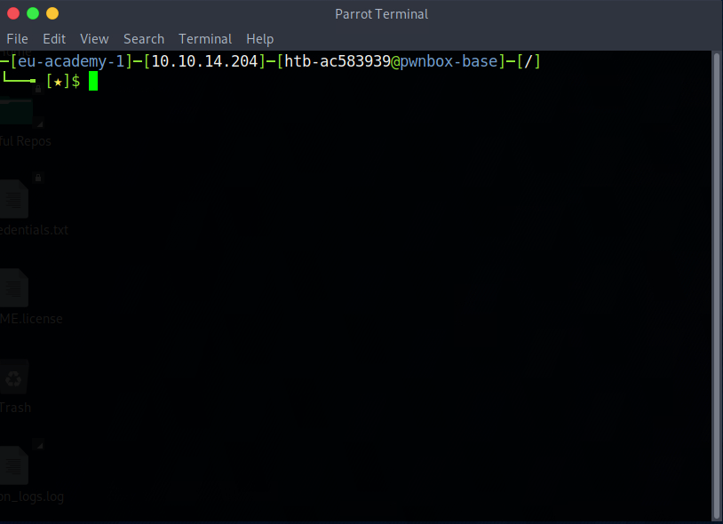
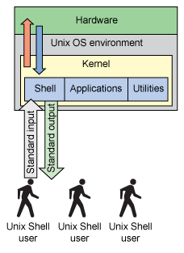
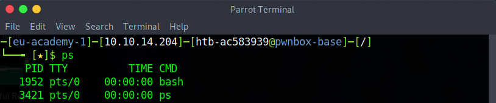
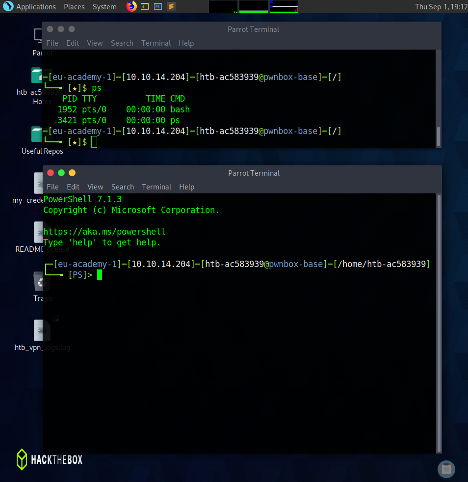

# Terminal & Shell

The terminal is where we enter commands. It is a CLI, which enables us to interact with the OS. This is the most common way to interact with Linux, and the intended way, due to the control it gives the user over their machine. The thing is, that when we have been using the terminal via our GUI icon, we have actually not been using a "terminal" as such, but a terminal emulator.



A terminal in the traditional sense is more like the keyboard, mouse, and screen you are using, for instance a terminal like the [VT-100](https://en.wikipedia.org/wiki/VT100). The terminal emulator, is a pretense, it simulates this and pretends to be the physical keyboard and monitor of such a device.

The terminal has one job, to execute our commands, allowing us to interact with our OS. The commands we use to interact with the computer is not the terminal, that is the [SHELL](https://www.geeksforgeeks.org/difference-between-terminal-console-shell-and-command-line/#:~:text=A%20terminal%20is%20a%20wrapper,processes%20commands%20and%20outputs%20results.). The SHELL is the UI we use to interact with the OS via the Linux Kernel. The terminal (or the terminal emulator (TE)) is what we use to interact with the SHELL, the SHELL then sends our commands to the kernel which interacts with the OS and in turn requests our hardware resources.

<div align="center">



</div>

The best way to imagine this is to picture the terminal emulator as your physical device, the keyboard and monitor you interact with, the SHELL is our user interface. There are different SHELLs but in Linux we commonly use BASH (Bourne Again SHELL). We can check what SHELL we are using via the ```ps```command. This will list all the running processes on our box, since we have our terminal emulator open this will report the process being run.



Alternative shells include: Z Shell, fish,Command Shell, Powershell, Bourne Shell (SH), Korn Shell. If you are a windows user you have likely at least seen, if not used, the Command Shell and possibly PowerShell (especially if you have a job where you frequently manage users using the windows Active Directory system).

We can actually use Powershell in Linux. Using our HTB instance we can click the blue icon on our main toolbar. This will open another Terminal Emulator, this time running PowerShell as the SHELL.



If you run the previous command (```ps```) whilst running this new SHELL you will notice that rather than BASH we have a process running called PWSH. Just a note, notice the ```$``` before your commands, this occurs every line, the moment you open your Terminal Emulator, when you are using a BASH SHELL, what does it mean? this just means you are an active user, you are logged in as a user on the system. You may be thinking, but, you are always logged in as a user? the very concept of using a computer usually requires you to be logged in to an account? yes, however, sometimes you may be logged in as the root user. When you are logged in as ```root``` you will notice that the ```$``` sign is transformed into a ```#```.

___

<div align="right">

[<< prev](./6_filesystemRoot.md) | [next >>]()
</div>