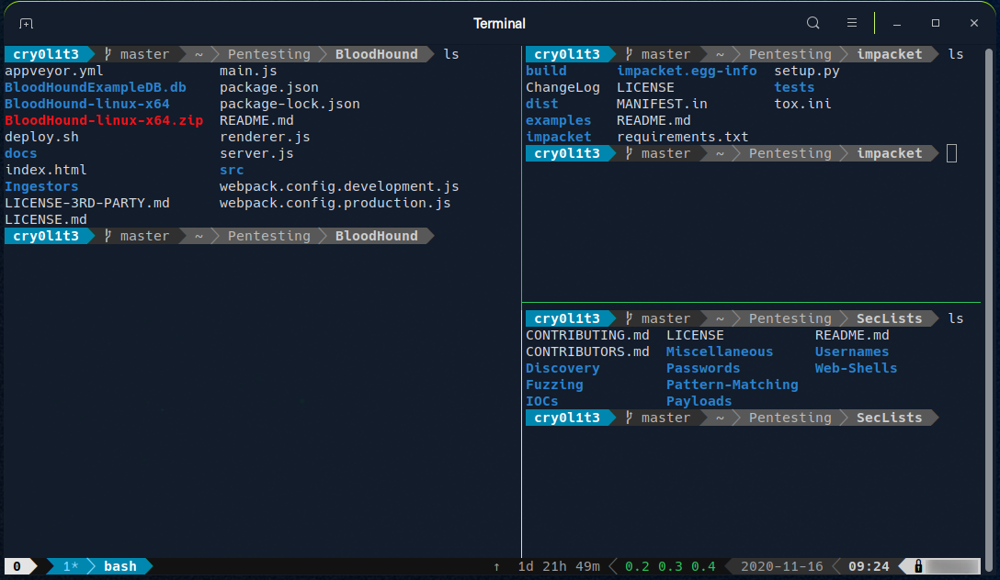
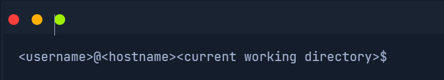
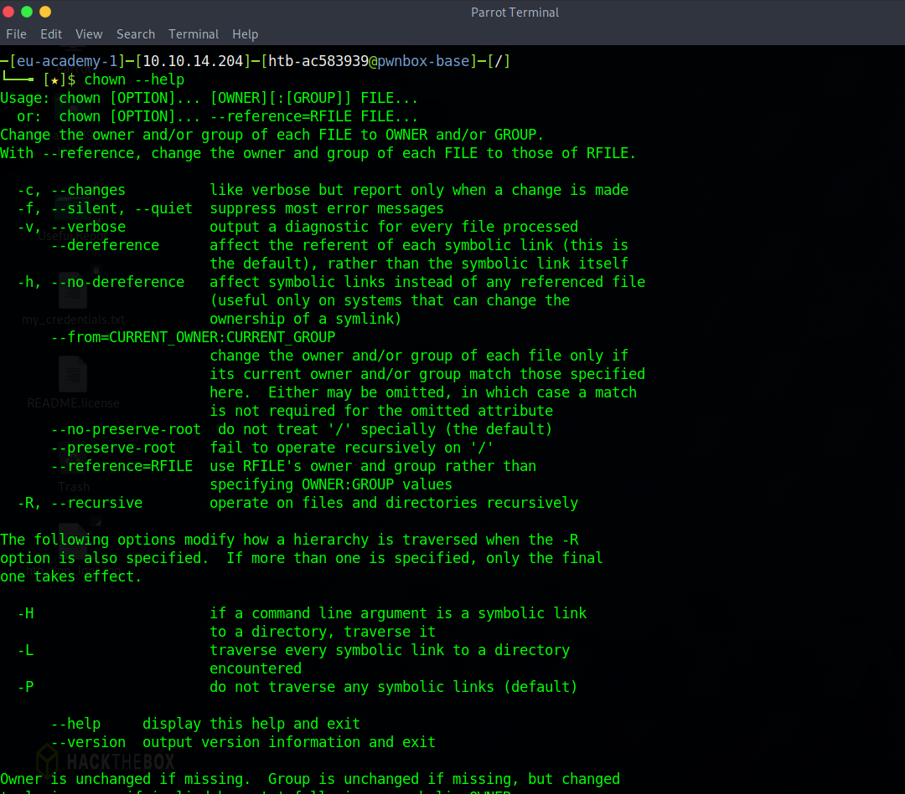
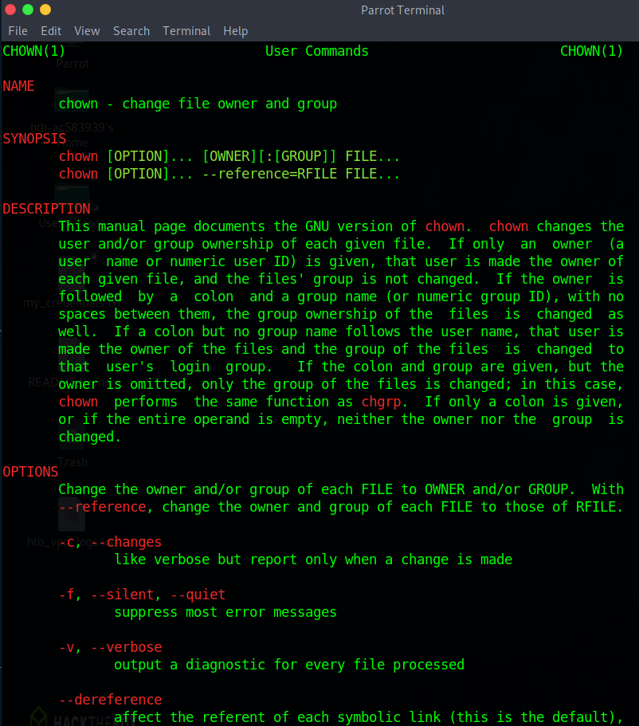
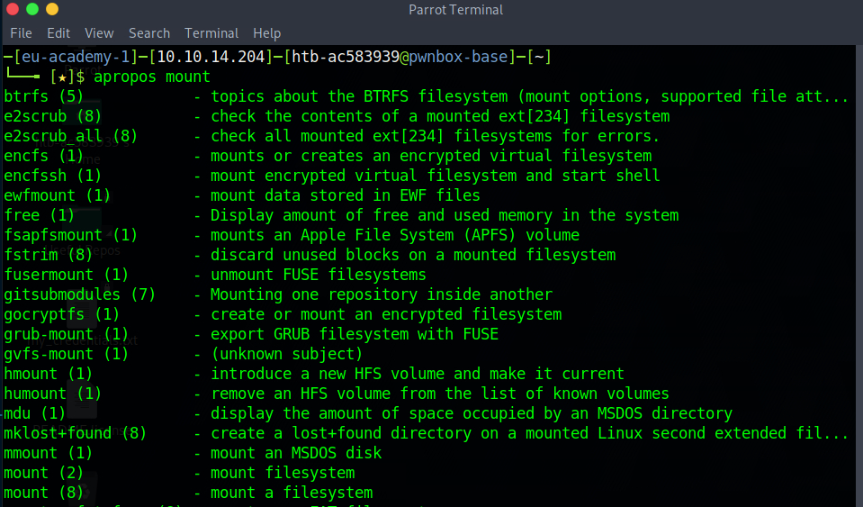
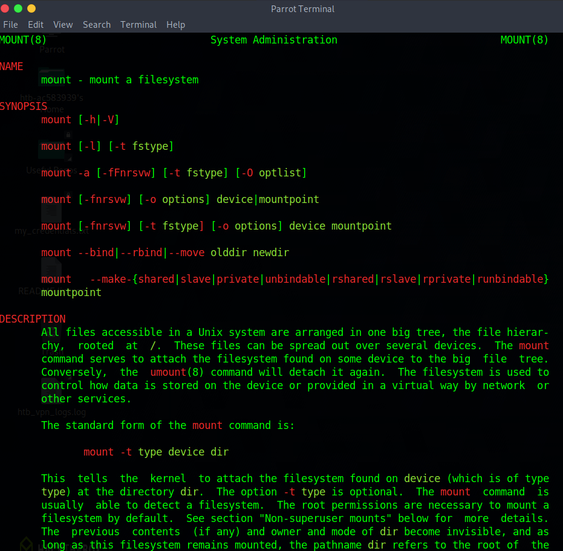

# Interacting With SHELLs

Learning to use the SHELL is crucial to using Linux. This is an essential skill to nearly any role whether you are planning to work in CyberSecurity, Development, Administration, Data, or any other sub-sector. You will, at the very least, need to understand the basics on Linux, even if your company operates using Windows PCs it is increasingly common to use containerised development stacks running a Linux OS. More than that, much of the worlds servers run on Unix based servers, you will likely be SSHing into remote shells at some point.

Servers are often based on Linux due to the reliability of Linux. As we mentioned previously, the SHELL provides a user interface for text-based input/output operations between the user and the kernel, not to be confused with Terminal Emulation software which emulates the function of a physical terminal (many of these exist; GNOME Terminal, XFCE4 Terminal, XTerm, etc...). You may also come accross CLIs which run additional terminals in a single terminal as multiplexers such as Tmux and GNU.



Terminal Emulators and multiplexers are beneficial extensions for the terminal, providing different methods and functions to work with the terminal. The above image shows a Tmux session splitting out work into multiple workspaces. The most commonly used shell in Linux is BASH, so you might be thinking, why not just use the GUI? I have used Windows most of my life with no need to touch a terminal!

As we have previously alluded to, you might not always have a GUI, not only this, but using the SHELL gives you far greater control, far more power, and is genuinely much faster than navigating a clunky GUI with a mouse. Using the SHELL will also encourage you to automate many of the processes with scripts, making manual work much more efficient (we listed some available shells in the previous [Chapter](./8_SHELL.md)).

The BASH SHELL has an easy to understand prompt by default. The prompt lists important information which you may need to know at any time. The ```~``` (tilde) symbold represents our home directory for a user, this is the default location when we login.

We can change and customise everything in here to suite our needs.



An important part of using Linux is self-learning. You need to be good at finding a solution, finding the answer for what you want to do. It is physically impossible to memorise everything, just recall the list of "files" in our bin folder, and then imagine adding onto that programs from other locations that we might install!

It is important to know how to get help, for which Linux has a multitude of options. The first, if you know the command you want to use, but forget how to use it, or maybe you want to know if there is a specific option. Most developers will include a ```help``` flag or option. You can usually access this by appending ```-h``` or ```--help``` on your command.



When we use ```help``` it does not list everything about the command, mostly, it lists what we need to know to use the command right now, including the flags we want to use. This is incredibly useful, but what if we want to know more information about a particular command? This is where the ```man``` page comes in. Every command we have can be looked up using ```man``` (manual) this will give us not only the same information as the help command, but also the description, and other information, this is the manual page, if you want to know more about a command, remember, ask the man.



So, you now know how to find help, how to ask for help, how to get more information on the commands, but in order to do that you need to first know the command exists. How do we know what commands we have access too? this is where ```apropos``` comes in. The ```apropos``` command searches for a manual page via names and descriptions, this uses a keyword search, which means that we can look for commands that we might want to use, say we want to mount a new drive, we can use the apropos command to find something which "mounts".



Cool, "nount a filesystem" looks promising, so, now we want to know more about it, ask the man!



So not only do we now know that the command exists, we know how it is used, and have a nice descriptive line on what this command actually does. We see that we can use this command to mount a filesystem found on some device, exactly what we were looking for!

___

Another useful resource for understanding commands can be found [here](https://explainshell.com/)
___

<div align="right">

[<< prev](./7_terminal.md) | [next >>]()
</div>