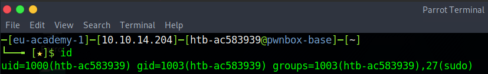
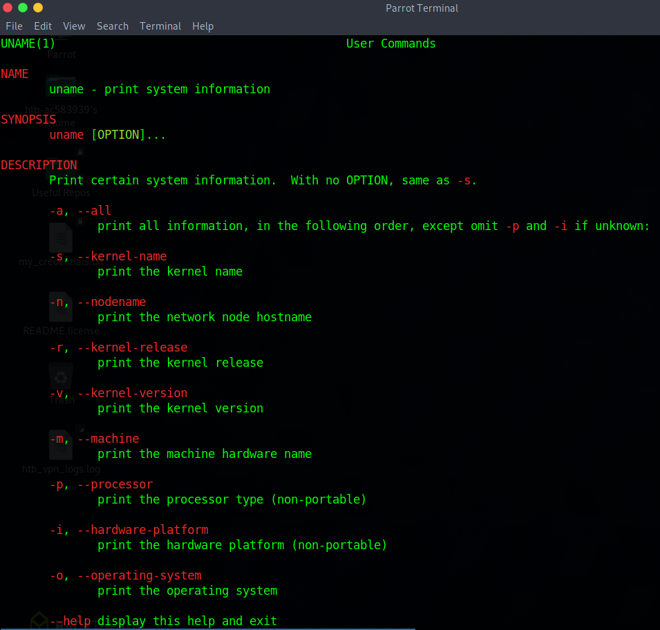
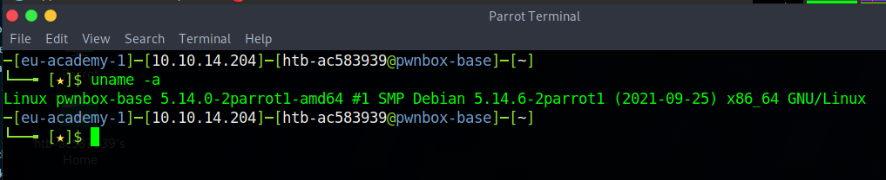
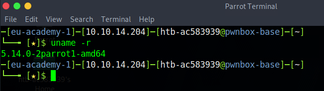
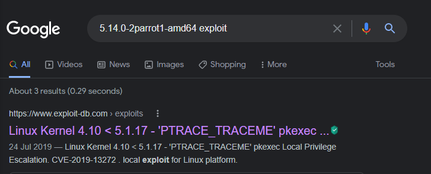

# System Information

We have covered much on accessing System information in previous chapters briefly. However, it is difficult to underestimate the necessity of accessing System Information. If something breaks, goes wrong, doesn't work as it should, or a process is not behaving, accessing System Information can tell you a lot about what is going on allowing you to diagnose and resolve the issue. This is true throughout Tech Support, Development, Cyber Security, etc... not only this, but if you are aiming to be a Penetration Tester it can tell you what you need to know about a system in order to exploit it.

Since we will often be working on many different Linux systems, and we can't always choose what system we are working with, we may not know our system inside out like we often do on our own machines. In this case we need to learn the structure and information about the system, its processes, network, devices, configurations, and more.

The quickest and easiest information we can find is the ```hostname```. Using this command we can quickly find the name of our host. ```whoami``` will tell us which user we currently are, and ```id``` will expand on the ```whoami``` command to print out our effective group membership IDs, this can especially be of interest to penetration testers who may be looking to see what access a user may have, as well as sysadmins looking to audit account permissions and group memberships.



In this example the ```htb``` group is of interest as it is a non-standard group. Next we will dig further into the ```uname``` command.



From our manual page we can see that if you provide the ```-a``` flag we should get all of the system information, in the order of: kernel name, hostname, the kernel release, kernel version, machine hardware name, and operating system. This will however omit the processor type ```-p``` and hardware ```-i``` platform if they are unknown. We can also find the Kernel release via ```uname -r```.



The kernel information is particularly useful to a Penetration Tester. Here, if we find the kernel release that we are using, a quick search reveals an exploit we might use.



A quick google search and we immediately find a link of interest.



It is highly recommended that you study the Man pages for commands, to understand what they are for and what information they can provide. Though this can be tedious we can learn a lot from studying the man pages.

___

<div align="right">

[<< prev](./8_SHELL.md) | [next >>](./10_userManagement.md)
</div>
